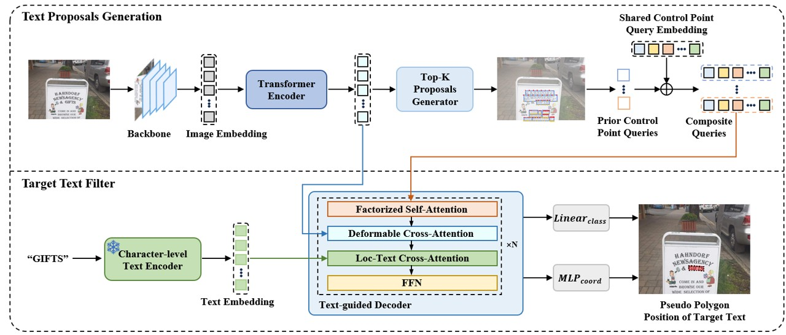

<h1 align="Center"> A Text-only Weakly Supervised Learning Framework for Text Spotting via Text-to-Polygon Generator </h1> 
This is the official repo for the paper "A Text-only Weakly Supervised Learning Framework for Text Spotting via Text-to-Polygon Generator".

## Introduction



## Usage
The environment setup follows the configuration used in the original [DPText-DETR](https://github.com/ymy-k/DPText-DETR?tab=readme-ov-file#installation) repository for compatibility. It is recommended to use Anaconda. Python 3.8 + PyTorch 1.9.1 (or 1.9.0) + CUDA 11.1 + Detectron2 (v0.6) are suggested.

- ### Installation
```
conda create -n project_name python=3.8 -y
conda activate project_name
pip install torch==1.9.1+cu111 torchvision==0.10.1+cu111 -f https://download.pytorch.org/whl/torch_stable.html
pip install opencv-python scipy timm shapely albumentations Polygon3
python -m pip install detectron2 -f https://dl.fbaipublicfiles.com/detectron2/wheels/cu111/torch1.9/index.html
pip install setuptools==59.5.0
git clone https://github.com/ymy-k/DPText-DETR.git
cd DPText-DETR
python setup.py build develop
```
